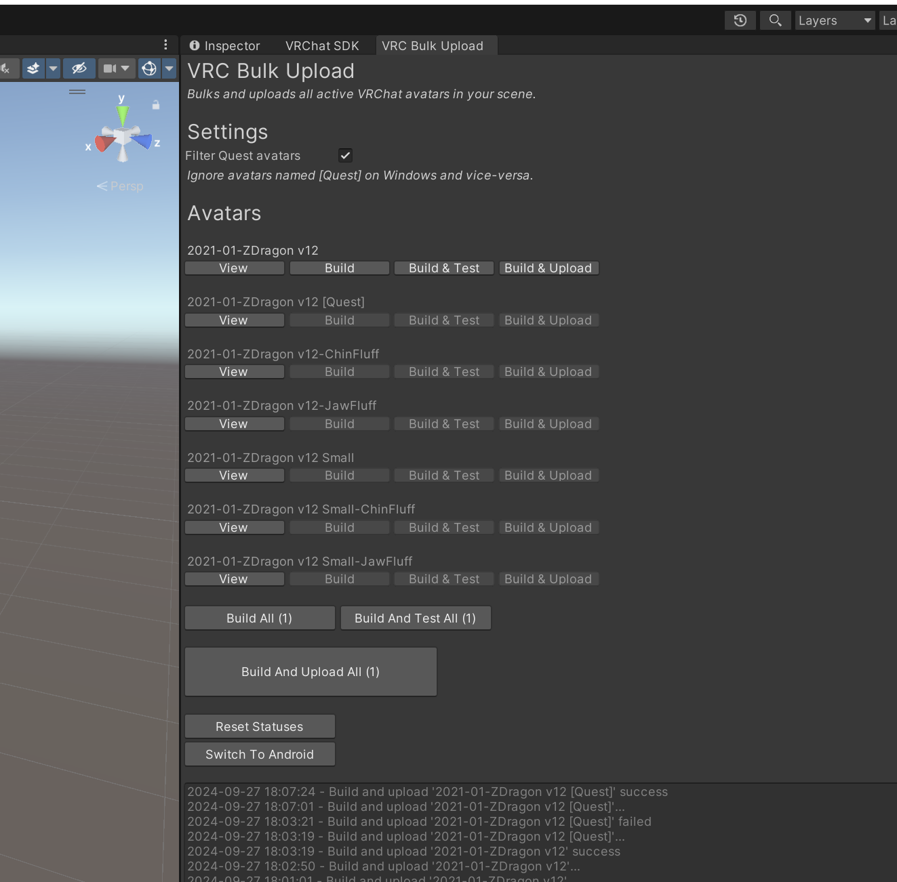

# VRC Bulk Upload

A Unity plugin that uploads all active VRChat avatars in your scene.

Tested in Unity 2022.3.22f1 with VRC SDK 3.7.1 (Sep 2024).

## Steps

1. Install the package into your project
2. Go to PeanutTools -> VRC Bulk Upload
3. Click the button to upload all of your active avatars in the current scene

## Development

## Release

Package `Package PeanutTools/VRC_Bulk_Upload` as a `.unitypackage`. Rename to `peanuttools_vrcbulkupload_$version.unitypackage`
